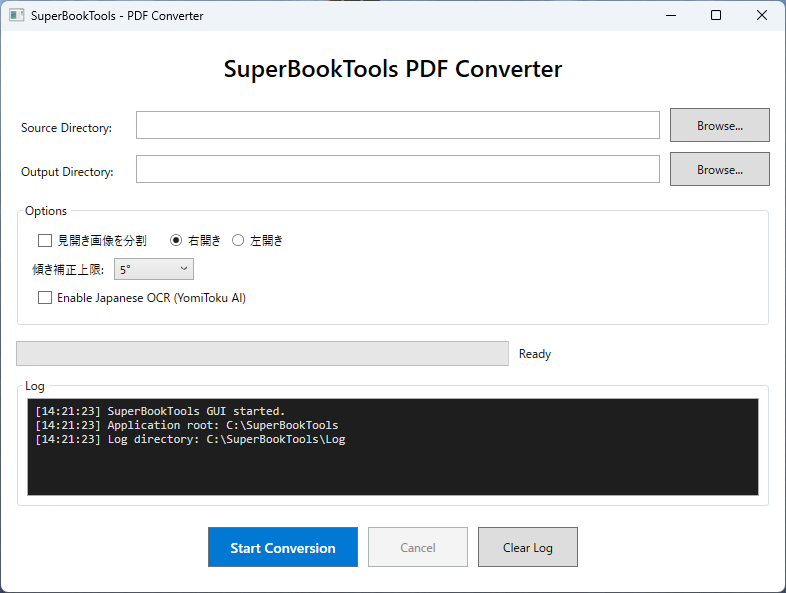

# SuperBookTools - スキャン書籍 PDF 高品質化ツール

**バージョン: 2.0.0** | 2026/02/03

## 概要

スキャンした書籍 PDF を、デジタル書籍並みに **クリアで読みやすく** 変換する SuperBookTools のGUIラッパーです。

紙の汚れ、裏写り、インクのにじみ、JPEG モアレノイズを AI 技術で除去し、傾き補正・オフセット調整・余白トリミングを自動で行います。さらに、日本語 AI OCR (YomiToku) による検索可能 PDF の生成にも対応しています。

## 主な機能

- **📖 高画質化・鮮明化**: RealEsrgan AI による画像鮮明化
- **📐 傾き自動補正**: ページごとの微妙な傾きを自動検出・補正
- **📏 オフセット自動調整**: ページ番号位置を基準に、各ページの上下左右のズレを自動補正
- **✂️ 余白自動トリミング**: 画面を最大限活用できるようトリミング
- **📚 見開き分割**: 見開きスキャン画像を左右に自動分割
- **🔢 ページ番号同期**: PDF のページ番号と書籍のページ番号を自動同期
- **🔍 日本語 AI OCR**: YomiToku による高精度 OCR (PDF/HTML/Markdown/JSON 出力)

機能詳細とコマンドライン版については [ORIGINAL_README.md](ORIGINAL_README.md) を参照してください。

## 動作環境

- **OS**: Windows 10/11 (64-bit)
- **メモリ**: 16GB 以上推奨
- **GPU**: NVIDIA GPU 推奨 (AI 処理高速化)
- **ストレージ**: 十分な空き容量 (処理中に一時ファイルを生成)

## インストール

1. [Releases](https://github.com/nankai-sokuryo/DN_SuperBook_PDF_Converter/releases) ページから最新の `SuperBookTools_Setup_x.x.x.exe` をダウンロード
2. インストーラーを実行
3. 画面の指示に従ってインストール（Python がインストールされます）

## 使い方

### 基本的な使い方

1. **Source Directory**: 変換元の PDF が格納されたフォルダを選択
2. **Output Directory**: 変換後の PDF を出力するフォルダを選択
3. 必要に応じてオプションを設定
4. **Start Conversion** をクリック

### オプション設定

| オプション | 説明 |
|-----------|------|
| **見開き画像を分割** | 見開きでスキャンされた画像を左右に分割します |
| **右開き/左開き** | 右開き、左開きを選択 |
| **傾き補正上限** | 傾き補正の最大角度 (1°/5°/10°) を選択。大きい値にすると誤補正のリスクも増加します |
| **Enable Japanese OCR** | YomiToku AI による日本語 OCR を有効化。検索可能 PDF および HTML/Markdown/JSON を出力します |

### 処理ステージ

変換処理は以下の 7 ステージで進行します:

1. **Stage 1/7**: PDF → 画像展開
2. **Stage 2/7**: 見開き分割 (オプション)
3. **Stage 3/7**: AI 高解像度化 (RealEsrgan)
4. **Stage 4/7**: 余白検出・トリミング
5. **Stage 5/7**: ページ番号 OCR・オフセット調整
6. **Stage 6/7**: 傾き補正
7. **Stage 7/7**: PDF 生成

## 外部ツール

本ソフトウェアは以下の外部ツールを使用しています:

- [ImageMagick](https://imagemagick.org/) - 画像処理
- [RealEsrgan](https://github.com/xinntao/Real-ESRGAN) - AI 画像高解像度化
- [Tesseract OCR](https://github.com/tesseract-ocr/tesseract) - ページ番号 OCR
- [QPDF](https://qpdf.sourceforge.io/) - PDF 処理
- [pdfcpu](https://pdfcpu.io/) - PDF 処理
- [ExifTool](https://exiftool.org/) - メタデータ処理
- [YomiToku](https://github.com/kotaro-kinoshita/yomitoku) - 日本語 AI OCR (オプション)

## ライセンス

本ソフトウェアは AGPL 3.0 の下で公開されています。詳細は [LICENSE](LICENSE) を参照してください。
